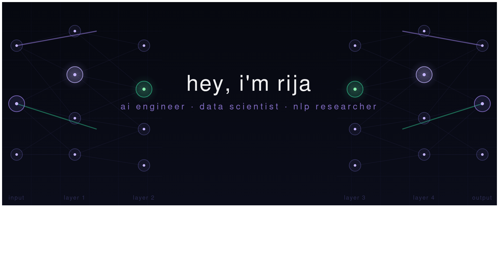

---

## About me

I build AI systems at the intersection of **real-world impact** and research — from map-free navigation for the visually impaired to explainable mental health reasoning engines. Currently wrapping up my final year in **Artificial Intelligence** at FAST-NUCES.

Outside of AI, I co-founded **RUI** — a minimalist fashion brand. I think good design, whether in models or clothes, comes down to the same thing: knowing what to leave out.

- 🎓 &nbsp;4th year AI student @ FAST-NUCES
- 🔍 &nbsp;Interests: ML · NLP · Knowledge Systems · Data Science
- 📬 &nbsp;Open to internships and research collaborations

---

## Tech stack

**Languages**

**AI / ML**

`RAG` &nbsp; `Prompt Engineering` &nbsp; `Semantic Search` &nbsp; `SPARQL / OWL` &nbsp; `Embeddings` &nbsp; `YOLO`

**Infra & tools**

---

## Projects

**🦯 Vision-to-Voice — Navigation for the Visually Impaired** &nbsp;`Feb 2026 – Apr 2026`

Map-free navigation system using real-time scene understanding. Integrated DINOv3 embeddings, YOLOE detection, and JEPA-based world modeling. Explainable voice guidance via SmoothGrad & AttnLRP.

`PyTorch` `DINOv3` `YOLOE` `EasyOCR` `OpenCV` `NetworkX`

---

**👗 LAYR — ML-based Fashion E-commerce** &nbsp;`Aug 2025 – Dec 2025`

End-to-end ML pipeline on 80M+ records (5.2GB). Hybrid recommendation engine, Sentence-BERT sentiment analysis, Prophet/ARIMA demand forecasting, and RFM customer segmentation.

`scikit-learn` `Sentence-BERT` `Prophet` `FastAPI` `PostgreSQL` `MLflow`

---

**🧠 Companion — Mental Health KRR System**

Ontology-driven knowledge representation for explainable mental health risk awareness. Uses OWL, RDF, SWRL, and SPARQL to reason over emotions and generate transparent causal explanations.

`OWL` `RDF` `SWRL` `SPARQL` `Python`

---

**⚡ Prodigy — AI Productivity Companion** &nbsp;`Team Lead · Feb 2024 – Jun 2024`

Full-stack productivity platform with GPT-4 note summarization, Pomodoro workflows, calendar sync, and focus analytics.

`React` `TypeScript` `Tailwind CSS` `Firebase` `OpenAI GPT-4`

---

## GitHub stats

---

## Experience

**Project Management Intern — AI Systems** &nbsp;·&nbsp; SysLab.ai &nbsp;`Nov 2025 – Feb 2026`
Coordinated AI-based assessment and proctoring platforms. Bridge between technical and non-technical teams across planning, QA, and release.

**Co-Founder — RUI** &nbsp;`Aug 2025 – Present`
Minimalist fashion brand. Led brand strategy, concept development, and product direction.

---

## Connect

